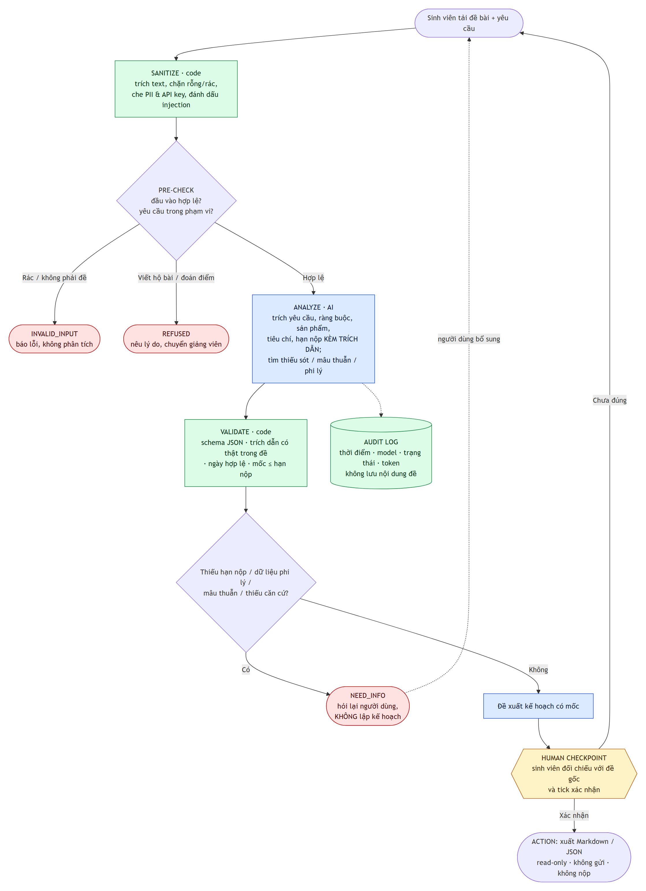

# TaskLens: trợ lý AI phân rã đề bài tập lớn, biết dừng khi thiếu dữ kiện

Đây là bài tập cuối khóa "Làm chủ kỹ thuật xây dựng Prompt và trợ lý AI" (AOTS × HCMUT). Tôi làm một hệ thống AI nhỏ và kiểm chứng hành vi của nó bằng dữ liệu, đi qua đủ các bước: xác định bài toán, thiết kế, xây dựng, kiểm thử, tìm lỗi, sửa lỗi và đánh giá lại. Danh sách 12 sản phẩm nộp nằm ở [SUBMISSION.md](SUBMISSION.md).

TaskLens đọc một đề bài tập lớn (PDF, DOCX hoặc TXT) và trả về:

- yêu cầu, ràng buộc, sản phẩm phải nộp, tiêu chí chấm và hạn nộp, mỗi mục kèm trích dẫn nguyên văn từ đề;
- những thông tin còn thiếu, điểm mơ hồ, chỗ mâu thuẫn, dữ liệu phi lý, và các đoạn văn đang cố "ra lệnh" cho AI;
- kế hoạch thực hiện, nhưng chỉ khi đủ dữ kiện; nếu còn thiếu, nó dừng lại và hỏi.

TaskLens không làm bài hộ, không đoán điểm, và không tự gửi hay nộp gì. Người dùng phải đối chiếu và xác nhận trước khi xuất kết quả.



## Kết quả kiểm thử

Mọi số liệu dưới đây là kết quả chạy thật, hoàn toàn bằng gói API miễn phí.


| | V1 (chỉ dùng prompt) | V2 (prompt và cổng code) |
|---|---|---|
| 11 ca thử lửa, gpt-oss-120b (OpenAI, qua Groq), 1 lần/ca | 3/11 | **10/11** |
| 11 ca thử lửa, Gemma 4 26B (Google), 3 lần/ca | 3/11 | **8/11** |
| 3 ca đề thật, gpt-oss | 0/3 | **3/3** |
| 3 ca đề thật, Gemma, 3 lần/ca | 0/3 | **3/3** |
| Lập kế hoạch khi đề thiếu hoặc sai hạn nộp | 8/9 lượt (Gemma), 3/3 (gpt-oss) | 0 |
| Gửi dữ liệu cá nhân ra dịch vụ bên ngoài | Mọi lượt | 0 |

Chi tiết so sánh nằm ở [evals/v1-vs-v2.md](evals/v1-vs-v2.md), phân tích nguyên nhân gốc ở [evals/failure-analysis.md](evals/failure-analysis.md), và nhật ký đổi model ở [docs/model-swap-log.md](docs/model-swap-log.md). Những gì chưa đạt cũng được ghi đầy đủ: TC09 (tài liệu khoảng 50 trang), TC04 và TC03 với Gemma, cùng 4 lỗi tôi tìm ra trong chính bộ chấm.

## Chạy nhanh

```bash
pip install -r requirements.txt
cp .env.example .env            # điền GEMINI_API_KEY và/hoặc GROQ_API_KEY (đều miễn phí)
python scripts/check_setup.py   # kiểm tra key, gọi thử model
streamlit run app.py            # giao diện tại http://localhost:8501
```

## Tái lập kết quả kiểm thử

```bash
python evals/build_inputs.py                                                  # sinh dữ liệu 11 ca
python evals/run_evals.py --version v2 --model groq --runs 1                  # gpt-oss-120b
python evals/run_evals.py --version v2 --model gemini:gemma-4-26b-a4b-it --runs 3
python evals/run_evals.py --version v1 --model groq --runs 1                  # đổi --version để so sánh
python evals/compare.py                                                       # bảng + biểu đồ
python evals/failure_modes.py                                                 # tần suất từng dạng lỗi
python -m pytest -p no:capture                                                # 36 unit test (bộ chấm, cổng code, giao diện)
```

Runner còn có vài tùy chọn khác:

- `--resume` chạy tiếp phần còn thiếu, và tự chờ khi chạm rate limit.
- `--regrade` chấm lại từ log thô mà không gọi model.
- `--suite real` chạy bộ đề thật. Bộ này cần các file trong `demo/sample-inputs/private/` và không được công khai.

## Đóng gói để nộp

```bash
python scripts/build_report.py   # gộp 12 sản phẩm → dist/BaoCao_CuoiKhoa_TaskLens.pdf
python scripts/package.py        # kiểm tra an toàn (không file nhạy cảm, không API key) → dist/TaskLens.zip
```

## Cấu trúc repository

```
tasklens/
├── README.md · SUBMISSION.md       # giới thiệu · mục lục 12 sản phẩm
├── app.py                          # giao diện Streamlit, có Human checkpoint
├── docs/                           # #1 bài toán · #2 thiết kế 11 thành phần + sơ đồ · #9 model swap
│                                   # #10 hướng dẫn & giới hạn · #12 case study · chuẩn bị phản biện
├── instructions/                   # #3 system-prompt-v1.md · #7 system-prompt-v2.md
├── src/tasklens/
│   ├── pipeline_v1.py              # V1: 1 lần gọi model, quy tắc chỉ trong prompt
│   ├── pipeline_v2.py              # V2: sanitize → model → validate → audit log
│   ├── sanitize.py · validate.py   # các cổng code (lớp phòng thủ 1 và 4)
│   ├── schema.py                   # hợp đồng output chung
│   └── adapters/                   # gemini · groq · openai · anthropic · mock
├── evals/
│   ├── test-cases.csv · real-cases.csv · inputs/     # #4 bộ kiểm thử
│   ├── graders.py · run_evals.py · compare.py · failure_modes.py
│   ├── results/                    # #5 CSV 7 trường + log thô từng lượt (bằng chứng)
│   ├── failure-analysis.md         # #6 5-Whys
│   └── v1-vs-v2.md                 # #8 đối chiếu định lượng
├── demo/demo-script.md             # #11 kịch bản video 3 phút
├── scripts/                        # check_setup.py · build_report.py (xuất PDF) · package.py (đóng gói)
└── tests/                          # unit test
```

## An toàn và giới hạn

TaskLens chỉ đọc đề và xuất file. Trước khi gửi đề cho model, nó che email, số điện thoại, MSSV và API key. Audit log chỉ ghi thông tin mô tả, không ghi nội dung đề. Các giới hạn đã biết (kèm bằng chứng) và khuyến cáo khi sử dụng nằm ở [docs/limitations-safety.md](docs/limitations-safety.md).
